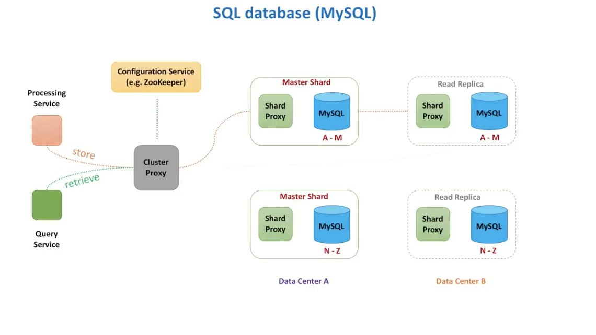
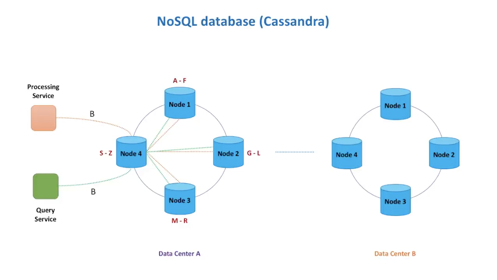

# Systems Design interview

**Problem statement,** how to count video view at large scale?

Interviewer: Let's design a system that:

1. Counts YouTubr video views
1. Counts likes in Facebook/Instagram
1. Calculates application perfromance metrics
1. Analyse data in real-time

**Question to ask as an interviewee**:

1. What does data analysis mean?
1. Who sends that data?
1. Who uses the results of this analysis?
1. What does real-time really mean?

**Why requirements clarification is so important?**

> Interviewer wants to understand how the candidate deals with ambiguity

> Why? Because this quality is so important for the daily job

Sofware Engineer:

> There could be many solution to the problem asked. And, only when I fully understand what features of the system we need to design, I can come up with a proper set of technologies and building blocks

Different engineers have different experiences and will use different stacks to count views

1. SQL Database (MySQL, PostgresSQL)
1. NoSQL Database (Cassandra, DynamoDB)
1. Cache (Redis)
1. Stream processing (Kafka + Spark)
1. Cloud native stream processing (Kinesis)
1. Batch processing (Hadoop MapReduce)

> Each has it's own pros and cons. Only pick those that address the system requirements. You may want to ask more questions, for example, look at can use the following categories: users & customers, scale, performance, cost.

1. Users/Customers

   1. Who will use the system?

      > all youtube users, wants to see only total views?

      > the owner of the videos, wants to see per hour stats of how fast their video is growing

      > a machine learning model, wants to use data to generate recommendations

   1. How the system will be used?
      > is it marketing department, to generate monthly reports?

1. Scale (read and write)
   1. How many read queries per second?
   1. How much data is queried per request?
   1. How many video views are processed per second by the system?
   1. Can there be spikes in traffic, and how big they may be?
1. Performance
   1. What is the expected write-to-read data delay?
      > can counts happen an hour later so we can we batch process or do we need real-time data analysis required on the fly
   1. What is expected p99 latency for read queries?
1. Should the design minimize the cost of development?
1. Should the design minimize the cost of maintenance?

> Spend a lot of time asking for these requirements. You would rather spend more time trying to find the scope of the question than jumping to solve a more complicated problem that is no where close to the solution.

## 1. Functional requirements - API

What things the system has to do, the system has to count video view events so:

1. `countViewEvent(videoId)`
1. `countEvent(videoId, eventType)`
   > where event type parameter could be of **views, likes, shares**
1. `processEvent(videoId, eventType, function)`
   > where function is of **count, sum, average**
1. `processEvents(listOfEvents)`
   > generalize, by allowing system to not process one by one but can batch a list (containing an object with details of requests) of events and process them

What data can be retirved? ex. the system has to return video view count for a **time period**:

1. `getViewsCount(videoId, startTime, endTime)`
1. `getCount(videoId, eventType, startTime, endTime)`
1. `getStats(videoId, eventType, function, startTime, endTime)`

> We can use functional requirements to create our api and generalize it it's usage and make several iterations to generalize the api

## 2. Non-Functional requirements

> The interviewer might challenge us with questions ex. Let's design a system that can handle YouTube scale & let's try to make it as fast as possible

Sofware Developer:

> CAP Theorem tells me I should be choosing between availability and consistencu, I will go with availability

1. Scalable
   > Tens of thousands of video views per second
1. Highly Performant
   > few tens of milliseconds to return total views count for a video
1. Highly Available
   > Survives hardware/networkk failures, no single point of failure

## 3. High-level architechture

**Let's start with something simple**

user <- browser <- processing service <- database -> query service -> browser -> user

Interview:

> I have so many questions, where should I start?

Software Developer:

> I should betterbe driving this conversation. Otherwise, I may quickly become lost in questions. And the first thing I want to do is understand what data we need to store and how we do it

1. We need to define a data model, what we store

   1. Individual events e.g every click with other details like timestamp, country
      > Pros: Fast writes, can slice and dice data however we need, can recalculate numbers if needed
      > Cons: Slow reads, Costly for a large scale eg. many events
   1. Aggregate data e.g per minute, in real-time
      > Pros: Fast reads
      > Cons: Requires data aggregation pipeline eg. very hard to fix bugs when they happen

   > It is hard to pick one. So ask the interviewer what is important. It might be better to use both. However the draw back of using both is that it will be costly but highly beneficials.

Interviwer:

> Can you please give me a specific database name and explain your choice?

Software developer:

> I know that both SQL and NoSQL databases can scale and perform well. Let me evaluate both types.

The evaluation:

> How to **scale writes**?

> How to **scale reads**?

> How to make bith **writes** and **reads fast**?

> How **not to lose data** in case of hardware faults and network partitions?

> How to achieve **strong consistency**?

> What are the tradeoffs?

> How to **recover data** in case of outage?

> How to unsure **data security**?

> How to make it **extensible** for data model changes in the future?

> Where to run **cloud** vs **on-promises** data centers?

> How much money will it all **cost**?

**SQL database, MySQL**

(Processing service, Query service) -> cluster proxy -> (shard proxy -> MySQL shardA-M, shard proxy -> MySQL shardN-Z) -> (Read Replica incase of outage)

> this is similar to what youtube uses for system design

> Using no-sql example with cassandra

> In Functional requirements we chose availability over consistency - we prefer to show users stale data than no data at all. Cassandra extends the concept of eventual consistency by offering tunable consistensy.

**How we store**

We want to build a report that shows the following properties.

> Informational about video

> No. of total views per hour for last several hours

> Information about the channel that the video belongs to

### In SQL relational data bases, MySQL

**video_info**

| videoId | name | ...               | channelId |
| ------- | ---- | ----------------- | --------- |
| A       | name | Distributed cache | channelId |

**video_stats**

| videoId | timestamp | count |
| ------- | --------- | ----- |
| A       | 15:00     | 2     |
| A       | 16:00     | 3     |
| A       | 17:00     | 8     |

**channel_info**

| channelId | name                    | ... |
| --------- | ----------------------- | --- |
| 111       | System Design Interview | ..  |

> To generate the report mentioned above, we run a join query that retrieves data from all three tabels. An important property of a relational database is that data is normalized. This simply means we minimize data deplication across different tables eg. we only store video nams on the `video_info` table and do not store it on any other table, because if the video name changes the we have to change in all other tables which can lead to inconsistent data

> Relational system no longer think in terms of nouns, but in terms of **queries** that will be executed in the system we desire, normalization is quite normal

### in NoSQL database (cassandra, logical view)

> Here for same same data above, we strore every thing together. Instead of adding rows like in relational database, we add more columns for every hour

| videoId | cahnnel name            | video name        | 1:00 | 16:00 | 17:00 | ... |
| ------- | ----------------------- | ----------------- | ---- | ----- | ----- | --- |
| A       | System Design interview | Distributed Cache | 2    | 3     | 8     | ... |

There are 4 types of NoSQL databases

1. Column eg. HBase, Cassandra,
1. Document eg. mongodb
1. Key-Value eg. Rocksdb
1. Graph eg. Neo4j, AWS Neptune, TigerGraph

> We chose cassandra for our representation of a NoSQL database because it is:

1. Fault tolerant
1. Scalable, both read-write through put increases linearly as new machines are added
1. It supports multi data center replication
1. Works well with time series data

> Remember other NoSQL databases have different architecture and are not like cassandra which is a wide column database that supports asynchronous masterless replication

## 3. Processing service

## Ingestion path components

1. Partitioner Service Client

   1. Blocking vs Non-blocking I/O
   1. Buffering and batching
   1. Timeouts
   1. Retries
   1. Exponential backoff and jitter
   1. Circuit breaker pattern

      > Drawbacks (trade-offs): makes the system hard to test.

1. Load Balancer

   > Distributes data traffic between multiple servers. There hardware and software load balancers. e.g Elastic Load Balancer from AWS

   1. Software vs Hardware load balancer
   1. Networking protocols e.g

      > a.) http load balancer - can look inside the message and make a load balancing decision based on the content of the message e.g cookie or head

      > b.) tcp balancer - forwards network packets without inspecting it

   1. Load balancing algorithms e.g

      > a.) round-robin algorithm

      > b.) least connetion algorithm

      > c.) least reponse time algorithm

      > c.) hash based algorithms

      > d.) DNS load balancing

1. Partitioner Service Partitions

   1. Partitions Strategy
   1. Service discovery
   1. Replication

      > Single-leader replication

      > Leaderless replication

      > Multileader replication

   1. Message format
      > Text
      > Binary format - faster to parse, shema is important
      > json format - increases message size, because it adds labeling of data
      > protocol buffer

# Data retrieval path

user -> Browser -> api gateway -> query service -> database (hot storage, cold storage, distributed cache)

# Data flow simulation

users -> api gateway -> load balancer -> partitioner service -> partitions -> partition consumer -> aggregator -> queue -> database writer -> database -> distrubuted cache -> query service -> user

# Technology stack

1. Client-side: Netty, Netflix Hystrix, Polly
1. Load balancing: NetScaler, NGINX, AWS ELB
1. Messaging Systems: Apache Kafka, AWS Kinesis
1. Data processing: Apache, Spark, Apache Flink, AWS Kinesis Data Analysis
1. Storage: Apache Cassandra, Apache HBase, Influx DB, Apache Hadoop, AWS Redshift, AWS S3

**Other**

1. Database solution (servers youtube database traffic since 2007): Vitess
1. Distributed cache: Redis
1. Deadletter Q mechanism: AWS SQS/ RabbitMQ
1. Data retrievement: RocksDB
1. Leader election for partitions and server discovery: Apache Zookeeper
1. Server discovery: Neflix Eureka
1. Monitoring our servie: AWS CloudWatch/ELK

> Binary: Avro, protobuf

> MurmurHash hashing function while partitioning

# Bottlenecks, tradeoffs

1. How to identify bottlenecks

1. How do you make sure the system is running healthy?

   > metrics

1. How to make sure the system produces accurate results?

   > Audit system. Make sure the expects results are what is the expected. You can use a Lambda System that does both a streaming and batching system and compare.

1. Let's say we've got a hugely popular video. Will it become a bottlenck?

1. What if the processing service cannot keep up with the speed new messages arrive?

# Summary

Functional requirements (API) -> non-functional requirements (qualities, sucure) -> detailed design -> bottlenecks and tradeoffs

**Functional requirements**

1. write down verbs
1. Define input parameters and return values
1. Make several iterations

**non-functional requirements (qualities)**

1. scalibily
1. Availability
1. Performance

**high-level design**

1. How data gets in
1. How data gets out
1. Try to drive the conversation

**Detailed design**

1. It's all about data (storage, transfer, processing)
1. Use fundamental concepts
1. Apply relevant technologies

**Bottlenecks and tradeoffs**

1.  Listen to the interviewer
